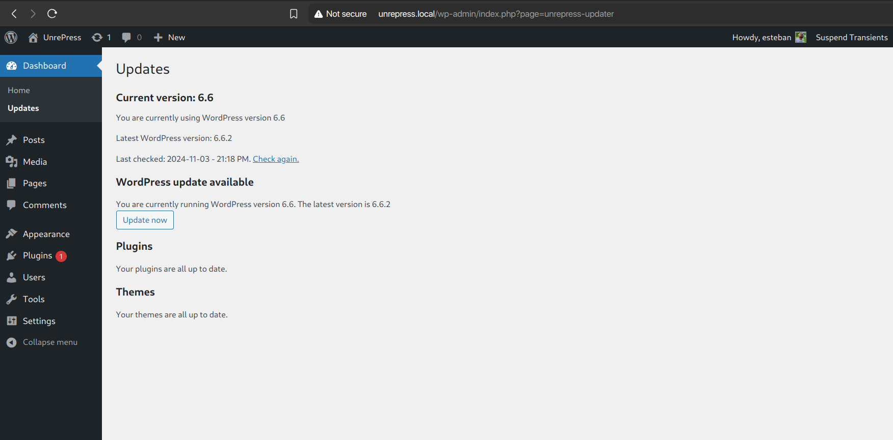
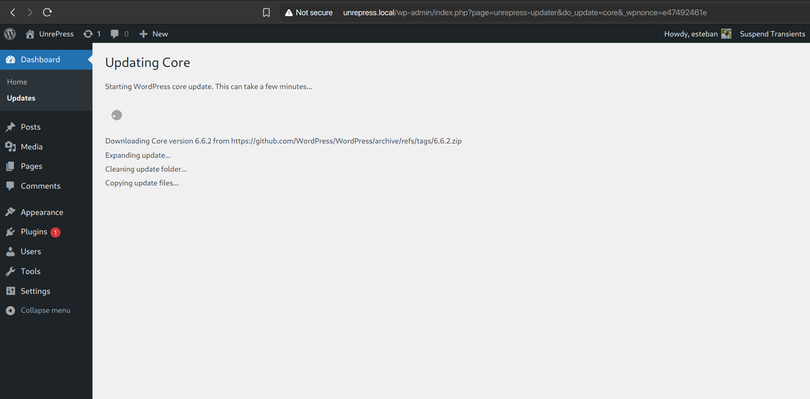
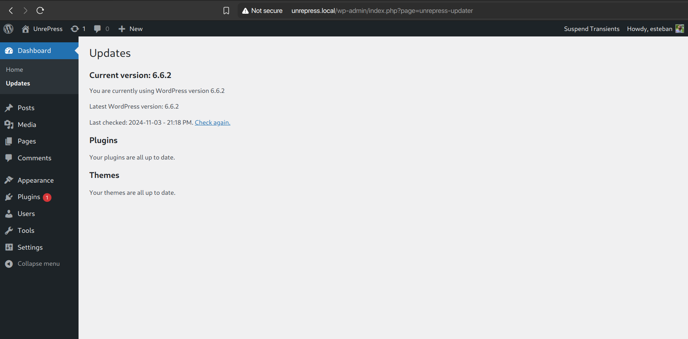

# UnrePress

UnrePress is a WordPress plugin that allows you to update WordPress core and plugins/themes directly from git providers (like GitHub, BitBucket or GitLab), instead of the "official" WordPress dot org repository.

## Why?

Although I'm grateful to him for co-creating WordPress (along with Mike Little), I'm even more grateful to the WordPress community and their work throughout all these years.

(I feel that) This is something that WordPress now needs: to liberate the core and plugin/theme updates, so we — the people who work with and on WordPress and sustain their lives and families with it — don't have to depend on a single person and live in uncertainty about their moods.

So we, the ones who extend and make WordPress better for everyone, can continue contributing and extending it freely and in peace.

Without fear of retaliation or repression.

## Main goal

To serve as a drop-in replacement for all "my personal site" functionality embeded into WordPress, but managed and administrated by the community itself.

UnrePress should eventually replace: WP core updates (done), plugins and themes installation, plugins and themes search and discover, plugins and themes updates, and all functionality that comes from dot-org.

Hoping to serve all this, all planned things, for free. Gratis.

## Screenshots

[](https://github.com/TCattd/UnrePress/blob/main/.wp-meta/screenshot-01.png)

[](https://github.com/TCattd/UnrePress/blob/main/.wp-meta/screenshot-02.png)

[](https://github.com/TCattd/UnrePress/blob/main/.wp-meta/screenshot-03.png)

[](https://github.com/TCattd/UnrePress/blob/main/.wp-meta/screenshot-04.png)

## Features

- Fetches WordPress core updates from the official WordPress GitHub repository.
- Updates WordPress core seamlessly from git providers, using WordPress Filesystem API.
- Blocks all requests to the "official" .org, .net and .com WordPress domains.

### Planned Features

- Auto-update UnrePress itself from GitHub.
- Plugin updates from git providers.
- Theme updates from git providers.
- Create a community maintained index of plugins and themes, so UnrePress can update them. Somewhat like package managers do (dnf, brew, npm, etc.).
- Integrate the index into WordPress itself, so users can search and install plugins/themes from within the admin panel.
- Add more git providers: BitBucket, GitLab, etc.
- Configuration interface.
- Expose the index vía web, for easy plugin/theme discoverability.

## Requirements

- PHP 8.1 or higher
- WordPress 6.5 or higher

## Installation

For now, download the zip from the `main` branch (code > download zip), and install it as any other WordPress plugin.

## Usage

1. Go to the WordPress admin panel.
2. Navigate to Dashboard > Updates.
3. Update your Core.

Now, when WordPress checks for updates, it will use the official GitHub repository for core updates and all other providers for plugin and theme updates.

## Development

To set up the development environment:

1. Install the development dependencies:
   ```
   composer install
   ```

## Contributing

Contributions are welcome! Please feel free to submit a Pull Request. Please: follow the PHP-CS-Fixer rules. Easier to read pull requests, and peace and some order in this chaotic drama.

Jump in into [an existing discussion](https://github.com/TCattd/UnrePress/discussions) if you want to help on any of the planned features.

Some of them will get priority over others. For example, having a functional website is really the last thing we should care about for now.

## License

This project is licensed under the GPL-2.0+ License.
