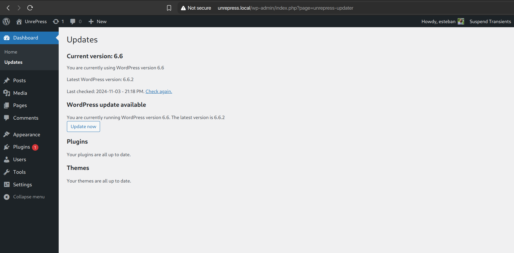
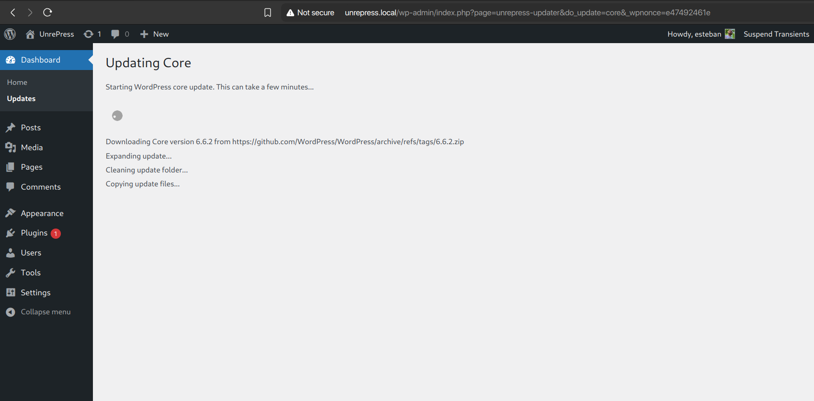
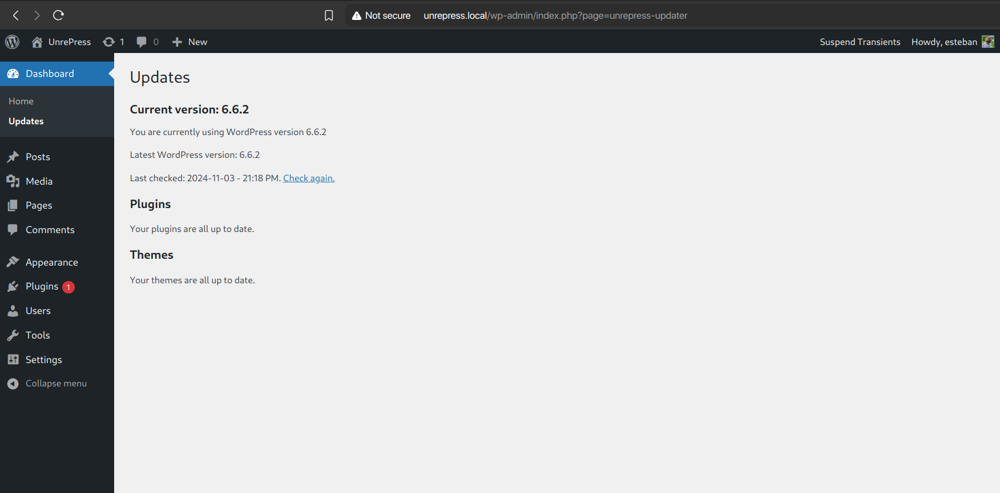

# UnrePress

UnrePress is a WordPress plugin that allows you to update WordPress core and plugins/themes directly from git providers (like GitHub, BitBucket or GitLab), instead of the "official" WordPress dot org repository.

# TOC

- [UnrePress](#unrepress)
  - [Main goal](#main-goal)
    - [Why?](#why)
  - [Screenshots](#screenshots)
- [Features](#features)
  - [Planned Features](#planned-features)
- [Installation](#installation)
  - [Requirements](#requirements)
  - [Usage](#usage)
- [Developers](#developers)
  - [How to add your plugin or theme to The Index](#how-to-add-your-plugin-or-theme-to-the-index)
  - [Contributing to UnrePress](#contributing-to-unrepress)
- [License](#license)

## Main goal

To serve as a drop-in replacement for all "my personal site" functionality embeded into WordPress, but managed and administrated by the community itself.

UnrePress should eventually replace: WP core updates (done), plugins and themes installation, plugins and themes search and discover, plugins and themes updates, and all functionality that comes from dot-org.

Hoping to serve all of this, for free. Gratis.

### Why?

Although I'm grateful to him for co-creating WordPress (along with Mike Little), I'm even more grateful to the WordPress community and their work throughout all these years.

(I feel that) This is something that WordPress now needs: to liberate the core and plugin/theme updates, so we — the people who work with and on WordPress and sustain their lives and families with it — don't have to depend on a single person and live in uncertainty about their moods.

So we, the ones who extend and make WordPress better for everyone, can continue contributing and extending it freely and in peace.

Without fear of retaliation or repression.

## Screenshots

[](https://github.com/EstebanForge/UnrePress/blob/main/.wp-meta/screenshot-01.png)

[](https://github.com/EstebanForge/UnrePress/blob/main/.wp-meta/screenshot-02.png)

[](https://github.com/EstebanForge/UnrePress/blob/main/.wp-meta/screenshot-03.png)

[](https://github.com/EstebanForge/UnrePress/blob/main/.wp-meta/screenshot-04.png)

# Features

- Fetches WordPress core updates from the official WordPress GitHub repository.
- Updates WordPress core seamlessly from git providers, using WordPress Filesystem API.
- Blocks all requests to the "official" .org, .net and .com WordPress domains.
- Auto-update UnrePress itself from GitHub.
- **Plugin updates from git providers** - GitHub, GitLab, and BitBucket support.
- **Theme updates from git providers** - GitHub, GitLab, and BitBucket support.
- **Modern Git Provider API Clients** - Uses dedicated API clients instead of manual HTTP requests for better performance and reliability.
- **Enhanced Security** - Input validation, capability checking, CSRF protection, and XSS prevention.
- **Auto-detection** - Automatically detects git provider from repository URLs.
- Community maintained index of plugins and themes, so UnrePress can update them. Somewhat like package managers do (dnf, brew, npm, etc.).

## Planned Features

- Integrate the index into WordPress itself, so users can search and install plugins/themes from within the admin panel.
- Add the ability to point UnrePress to a different index.
- Configuration interface.
- Expose the index vía web, for easy plugin/theme discoverability.

See more in [Planned Features Discussions](https://github.com/EstebanForge/UnrePress/discussions/categories/planned-features).


# Installation

Go to the [releases](https://github.com/EstebanForge/UnrePress/releases) page and download the most recent zip release.

Consider that this proyect is still in active development and not stable. Don't use this on production, until 1.0 is released.

## Requirements

- PHP 8.1 or higher
- WordPress 6.5 or higher

## Developers

### Modern Architecture

UnrePress uses modern PHP development practices and design patterns:

- **PSR-12 Coding Standards** with automated code style fixing
- **PSR-4 Autoloading** for consistent class organization
- **Dependency Injection** for better testability and flexibility
- **Provider Pattern** for unified git provider integration
- **Factory Pattern** for provider instantiation and auto-detection
- **Security Middleware** with comprehensive input validation and capability checking
- **288 Unit Tests** using Pest v4 (modern replacement for PHPUnit)

### Git Provider Support

UnrePress supports multiple git providers through dedicated API clients:

- **GitHub**: `knplabs/github-api` (v3.16.0)
- **GitLab**: `m4tthumphrey/php-gitlab-api` (v12.0.0)
- **Bitbucket**: `bitbucket/client` (v5.0.0)

### Security Features

- **Input Validation**: All user inputs validated via `InputValidator`
- **Capability Checking**: WordPress capability verification via `CapabilityChecker`
- **CSRF Protection**: Nonce verification for all state-changing operations
- **XSS Prevention**: Output escaping and sanitization
- **SQL Injection Prevention**: Prepared statements and input sanitization
- **Path Traversal Prevention**: File path validation and sanitization

### Development Commands

```bash
# Run tests
vendor/bin/pest

# Code style check
composer cs:check

# Auto-fix code style
composer cs:fix

# Regenerate autoloader
composer dump-autoload
```

## Usage

1. Go to the WordPress admin panel.
2. Navigate to Dashboard > Updates.
3. Update your WordPress core, plugins and themes as always do.

Now, when WordPress checks for updates, it will use the official GitHub repository for core updates and all other providers for plugin and theme updates.

# Developers

## How to add your plugin or theme to The Index

Do you want to add your plugin or theme to the UnrePress Index?

Check our [Wiki for instructions](https://github.com/EstebanForge/UnrePress/wiki).

## Contributing to UnrePress

Want to contribute? Check our [Contributing Guidelines](https://github.com/EstebanForge/UnrePress/wiki) at our Wiki.

# License

This project is licensed under the GPL-2.0+ License.
